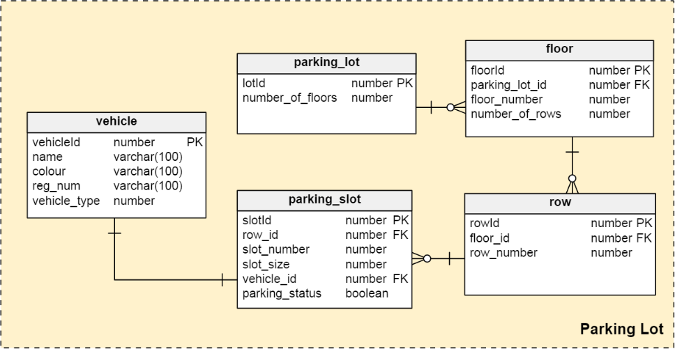

# Parking Lot API

An API to facilitate parking of Vehicles in a parking lot.

### Problem Statement
Create a rest service that mimics a parking lot. 
The rest service will receive a parking request (vehicle number) - from client (Say Postman) 
Then the service will interact with SOAP service (Also to be created by you). 
The SOAP service will return vehicle details (Type {Car, Bike, etc..}, Color, Name).
Based on the "Type" returned the rest service will allot a parking space (applying some business rules - in guidelines below) and return a response object to client. (To Postman).
 
#### General Guideline:
Use JSON and showcase the use of complex objects. Unit tests are must.
Can use in-memory DB to persist parking spots already allotted. 
Parking lot business rules can be: 
1) The parking lot can have multiple levels. Each level has multiple rows of spots. (You can decide on levels and spots)
2) The parking lot can park bike, cars, and buses.
3) If spot for a particular type of vehicle is full, it can park in the next higher spot (if available).
 
### Solution
**parkingLot** is the parent maven module which contains two child modules :
* **parkingAPI** - exposes the endpoints to allocate and deallocate parking-spots to vehicles.
* **vehicleInfoService** - acts as a third-party vehicle info service (SOAP)

Tech Stack - Springboot, HSQLDb, wsdl4j, Jaxb2Marshaller, jUnit, mockito

#### Deployment guide

Deployment order:
1. vehicleInfoService
```sh
cd vehicleInfoService
mvn spring-boot:run
```
the WSDL will be available @ [http://localhost:8080/ws/vehicles.wsdl](http://localhost:8080/ws/vehicles.wsdl)

2. parkingAPI
```sh
cd parkingAPI
mvn spring-boot:run
```
the API will be up @ http://localhost:8182<br/>
Endpoints:<br/>
```sh
/api/parking/get/vehicleinfo/{vehicle_number}
/api/parking/allocate/{vehicle_number}
/api/parking/get/vehicles
/api/parking/get/slots
```

Currently vehicleInfoService provides vehicle information for only 3 vehicle reg numbers: 
* BUGATTI-01
* TOMAHAWK-01
* SUPER-01

Sample requests:
```sh
curl -X GET \
http://localhost:8182//api/parking/allocate/BUGATTI-01
```
Sample Response:
```json
{
    "slotId": 101,
    "slotNumber": 1,
    "parkingRow": {
        "rowId": 100,
        "parkingFloor": {
            "floorId": 100,
            "parkingLot": {
                "lotId": 100,
                "floorCount": 3
            },
            "floorNumber": 1,
            "rowsCount": 10
        },
        "rowNumber": 1
    },
    "status": "OCCUPIED",
    "slotSize": "MEDIUM",
    "vehicle": {
        "vehicleId": 101,
        "name": "Bugatti Veron",
        "colour": "White",
        "regNumber": "BUGATTI-01",
        "wheels": 4,
        "vehicleType": "CAR"
    }
}
```

#### DB Schema

